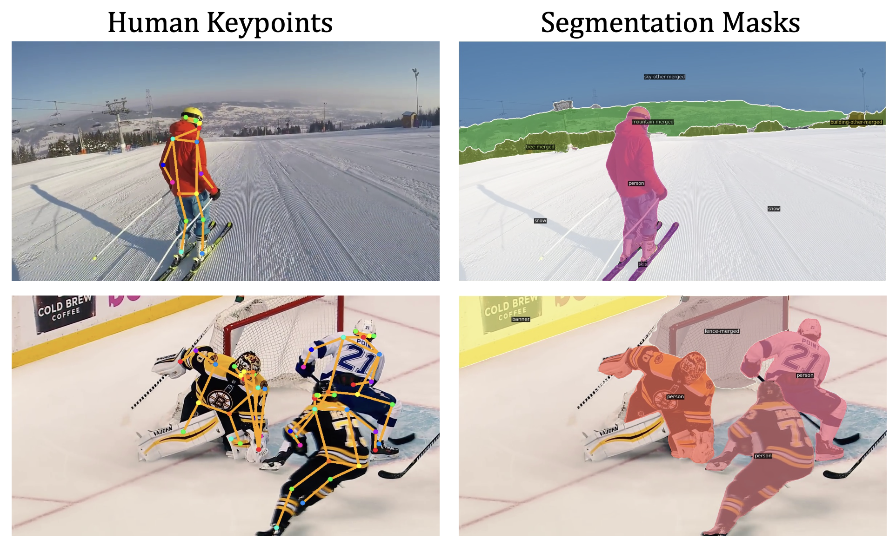

# SportsFlow
SportsFlow is a video frame interpolation deep learning model specifically designed for sports broadcasts. The goal is to enhance the viewing experience of low frame rate broadcasts, especially in regions with limited bandwidth or for streaming services seeking to minimize data usage without compromising quality.

## Dataset

Video sequences of SportsSloMo dataset can be downloaded at the [link](https://vil.khoury.northeastern.edu/files/sportsslomo_video_seqs.zip).
 
**Note** that the data that we provide in the link is video files, additional processing is needed to extract frames from these video clips. Please consider following the step in the **Preparation** part below.

Our dataset has the following directory format:

```
├──── SportsSloMo_frames/
    ├──── clip_0000/
       ├──── frame_0000.png
             ├──── ...
    ├──── clip_0001/
       ├──── frame_0000.png
             ├──── ...
    ├──── ...
```

### Preparation

```
mkdir SportsSloMo_video
cd SportsSloMo_video
## Download sportsslomo_video_seqs.zip to this directory
unzip sportsslomo_video_seqs.zip

## Extract frames for each clip
python extract_frames.py
```

## Installation

Create a conda environment and install dependencies:

```

conda create --name SportsFlow python=3.8
conda activate SportsFlow

# Install the according versions of torch and torchvision
pip install torch==1.12.1+cu113 torchvision==0.13.1+cu113 torchaudio==0.12.1 --extra-index-url https://download.pytorch.org/whl/cu113

# Install required packages 
pip install -U opencv-python
pip install -r requirements.txt

# Install the according version of CuPy
pip install cupy_cuda113==10.6.0

## Install packages for Mask2Former
# Install detectron2, note that gcc & g++ ≥ 5.4 are required.
pip install ninja
git clone https://github.com/facebookresearch/detectron2.git
cd detectron2
pip install -e .
# Install Mask2Former
cd ..
git clone https://github.com/facebookresearch/Mask2Former.git
cd Mask2Former
cd mask2former/modeling/pixel_decoder/ops
sh make.sh

```

## HumanLoss

To improve the existing video frame interpolation models on our human-centric SportsSloMo benchmark, we introduce two loss terms considering the human-aware priors. We propose loss terms based on human segmentation in the panoptic setting and human keypoints estimation as extra supervision for intermediate frame synthesis.

### Pipeline Overview
Both of our proposed human-aware loss terms are model agnostic and can be easily integrated into any video frame interpolation approach.

### Data Preparation
We provide scripts and instructions to acquire ground-truth segmentation masks for our human-aware loss terms.

**Note** that large storage space is needed to store the extracted data, so make sure that there is enough storage space in your machine:)

#### Visualization of human keypoints and segmentation masks
<center></center>

#### Keypoint Preparation
```
# Install ViTPose_pytorch 
git clone https://github.com/jaehyunnn/ViTPose_pytorch.git
cd ViTPose_pytorch
mkdir checkpoints
# download model to this directory [link](https://1drv.ms/u/s!AimBgYV7JjTlgTBm3dCVmBUbHYT6?e=fHUrTq)

# Install Yolov8
pip install ultralytics
```

#### Segmentation Preparation
```
# Download Mask2Former Checkpoint
cd Mask2Former
mkdir checkpoints
# download model to this directory [link](https://dl.fbaipublicfiles.com/maskformer/mask2former/coco/panoptic/maskformer2_swin_large_IN21k_384_bs16_100ep/model_final_f07440.pkl)

# Extract segmentation masks for auxiliary loss terms
python extract_segmentation.py

```

## Contact
If you have any questions, please send an email to [Rugved Mhatre](https://rugvedmhatre.github.io) - rugved.mhatre@nyu.edu 
